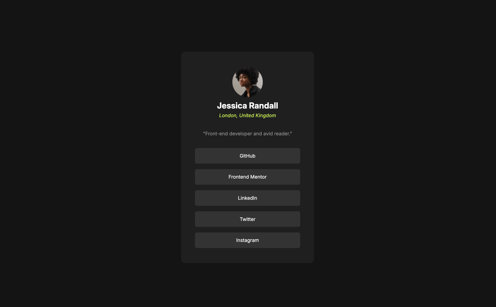
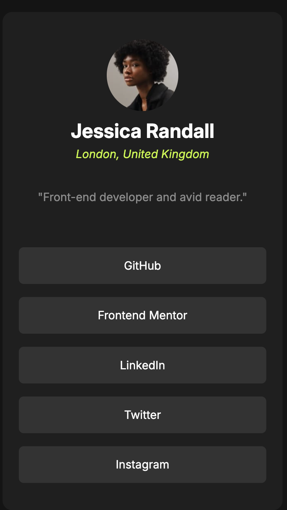

# Frontend Mentor - Social links profile solution

This is a solution to the [Social links profile challenge on Frontend Mentor](https://www.frontendmentor.io/challenges/social-links-profile-UG32l9m6dQ). Frontend Mentor challenges help you improve your coding skills by building realistic projects.

## Table of contents

- [Frontend Mentor - Social links profile solution](#frontend-mentor---social-links-profile-solution)
  - [Table of contents](#table-of-contents)
  - [Overview](#overview)
    - [Screenshot](#screenshot)
    - [Links](#links)
  - [My process](#my-process)
    - [Built with](#built-with)
    - [Useful resources](#useful-resources)
  - [SEO and Accessibility](#seo-and-accessibility)
    - [Microdata Integration](#microdata-integration)
    - [Accessibility Improvements](#accessibility-improvements)
    - [External Links](#external-links)
    - [Semantic Structure](#semantic-structure)
    - [Benefits](#benefits)
  - [Author](#author)

## Overview

### Screenshot

### Links

- Solution URL: [Repo - here](https://github.com/josemguerra/fem-social-links-profile)
- Live Site: [Social links profile - here](https://josemguerra.github.io/fem-social-links-profile/)

## My process

### Built with

- Semantic HTML5 markup
- CSS custom properties
- BEM methodology (Block, Element, Modifier)
- Flexbox
- Mobile-first workflow

### Useful resources

- [BEM Methodology](https://en.bem.info/methodology/) - The idea behind it is to divide the user interface into independent blocks. I really liked this pattern and will use it going forward.
- [Semantic HTML](https://www.semrush.com/blog/semantic-html5-guide/) - This is an amazing article which helped me finally understand semantic HTML tags. I'd recommend it to anyone still learning this concept.
- [Flexbox](https://css-tricks.com/snippets/css/a-guide-to-flexbox/) - This complete guide explains everything about flexbox, focusing on all the different possible properties for the parent element (the flex container) and the child elements (the flex items).
- [Schemas.org](https://schema.org/docs/schemas.html) - A collaborative, community activity with a mission to create, maintain, and promote schemas for structured data.

## SEO and Accessibility

### Microdata Integration

- Used `itemscope` and `itemtype` for the `article` to define it as a `Person`.
- Mapped `itemprop` attributes to content elements like `name`, `description`, `image`, `creator`, and `author` for better semantic meaning and SEO.

### Accessibility Improvements

- Updated the `alt` attribute of the image to provide a more descriptive and useful context.

### External Links

- Included `rel="noopener noreferrer"` for all external links to enhance security and performance.

### Semantic Structure

- Used a `figure` tag as a semantic tag that represents self-contained graphical content for the profile image.
- Clearly defined elements with roles like `footer` and `main` for better screen reader support.

### Benefits

- **Search Engine Optimization**: The microdata ensures search engines can understand the content better, improving its ranking and rich snippets.
- **Enhanced Usability**: Screen readers can now interpret the purpose and structure of the content more effectively.
- **Security and Performance**: External links are safer with `rel="noopener noreferrer"`.

## Author

- Frontend Mentor - [@josemguerra](https://www.frontendmentor.io/profile/josemguerra)
